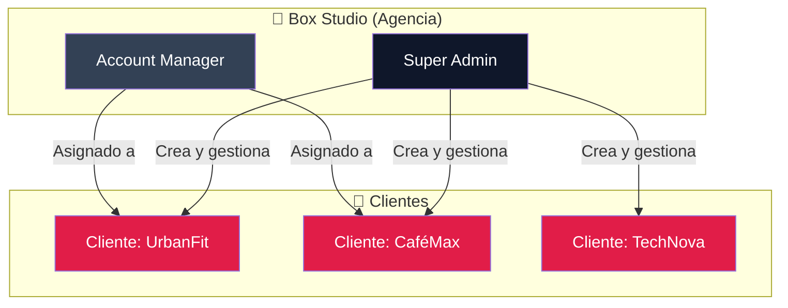
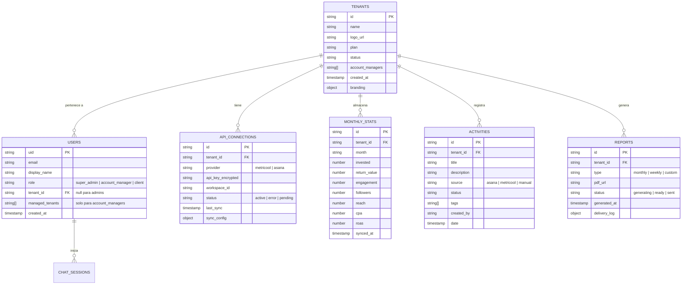
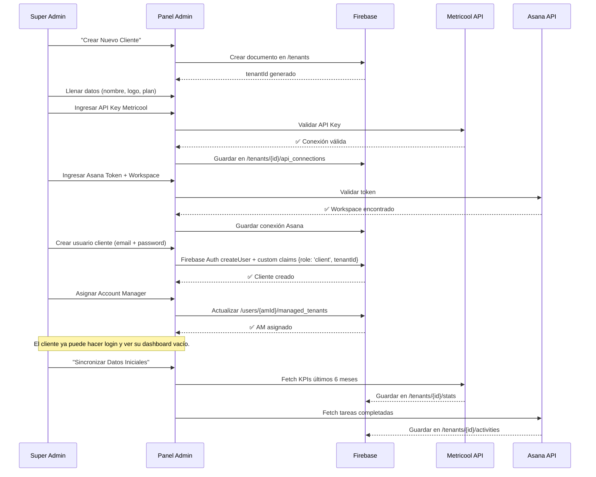
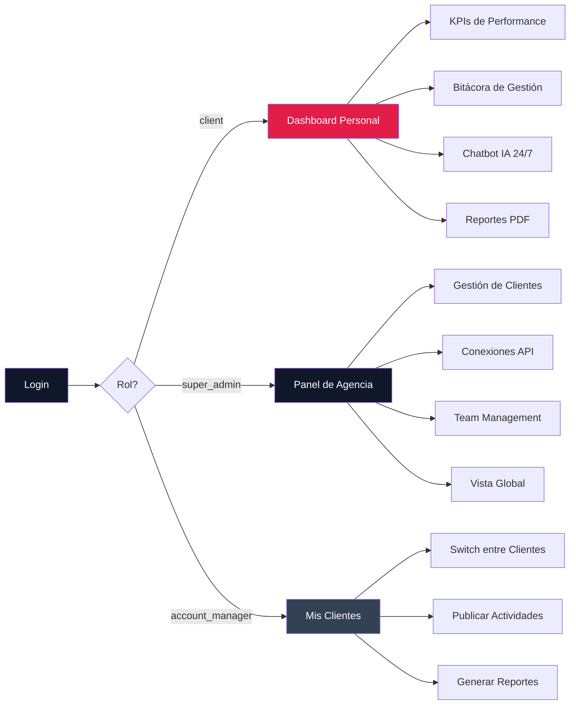

# Plan de Arquitectura Multitenant — Box Studio Client Portal

> [!IMPORTANT]
> Este plan redefine la arquitectura completa del portal. Box Studio es **la agencia** que gestiona múltiples clientes. Cada cliente tiene su propio dashboard aislado con datos de Metricool y Asana conectados individualmente.

---

## 1. Modelo de Roles y Acceso



| Rol | Acceso | Acciones |
|:----|:-------|:---------|
| **Super Admin** | Todo el sistema | Crear/editar/eliminar clientes, conectar APIs, asignar Account Managers, ver todos los dashboards |
| **Account Manager** | Clientes asignados | Ver dashboards de sus clientes, publicar actividades, generar reportes |
| **Cliente** | Solo su tenant | Ver su dashboard, bitácora, usar chatbot IA, descargar reportes |

---

## 2. Modelo de Datos (Firestore)



### Reglas de Seguridad Firestore

```javascript
// Estructura de colecciones con aislamiento por tenant
rules_version = '2';
service cloud.firestore {
  match /databases/{database}/documents {

    // Solo super_admins pueden leer/escribir tenants
    match /tenants/{tenantId} {
      allow read: if isAdminOrAssigned(tenantId);
      allow write: if isSuperAdmin();

      // Sub-colecciones aisladas por tenant
      match /stats/{statId} {
        allow read: if isTenantMember(tenantId);
        allow write: if isAdminOrAssigned(tenantId);
      }

      match /activities/{actId} {
        allow read: if isTenantMember(tenantId);
        allow write: if isAdminOrAssigned(tenantId);
      }

      match /reports/{reportId} {
        allow read: if isTenantMember(tenantId);
        allow write: if isAdminOrAssigned(tenantId);
      }
    }

    // Usuarios globales
    match /users/{userId} {
      allow read: if request.auth.uid == userId || isSuperAdmin();
      allow write: if isSuperAdmin();
    }
  }
}
```

---

## 3. Flujos de la Agencia (Super Admin)

### 3.1. Onboarding de un Nuevo Cliente



### 3.2. Pantallas del Panel de Agencia

| Pantalla | Descripción | Componentes |
|:---------|:------------|:------------|
| **Listado de Clientes** | Grid/tabla con todos los tenants, estado de conexión APIs, último sync, Health Score | `TenantListView` |
| **Detalle de Cliente** | Vista completa del tenant: datos, APIs, usuarios, actividad | `TenantDetailView` |
| **Crear/Editar Cliente** | Formulario wizard paso a paso | `TenantWizard` |
| **Conexiones API** | Estado de Metricool + Asana por cliente, botón re-sync | `ApiConnectionsPanel` |
| **Account Managers** | Lista de AMs, clientes asignados, carga de trabajo | `TeamView` |
| **Reportes Globales** | Vista consolidada de performance de todos los clientes | `AgencyOverview` |

---

## 4. Flujo del Cliente



El cliente **nunca** ve que existen otros tenants. Su experiencia es:
- Login → Su dashboard con su logo y su Account Manager
- Solo ve **sus** datos de Metricool y Asana
- Puede consultar al chatbot IA con **su** contexto
- Recibe reportes personalizados

---

## 5. Estructura de Archivos Propuesta

```
src/
├── main.tsx
├── App.tsx                          # Router principal con AuthGuard
├── index.css
│
├── ingesta/                         # Capa de datos
│   ├── mockData.ts                  # Datos de demo (multitenant)
│   ├── services/
│   │   ├── metricoolService.ts      # Fetch KPIs desde Metricool API
│   │   ├── asanaService.ts          # Fetch tareas desde Asana API
│   │   └── syncService.ts           # Orquestador de sincronización
│   └── types/
│       ├── tenant.ts                # Tenant, ApiConnection
│       ├── user.ts                  # User, Role
│       ├── stats.ts                 # MonthStat
│       └── activity.ts              # Activity
│
├── procesamiento/                   # Capa de lógica
│   ├── firebase.ts                  # Config Firebase
│   ├── auth/
│   │   ├── AuthContext.tsx           # Auth state + role-based access
│   │   ├── AuthGuard.tsx            # Route protection por rol
│   │   └── useAuth.ts              # Hook de autenticación
│   ├── tenant/
│   │   ├── TenantContext.tsx        # Tenant activo (para AM/Admin)
│   │   ├── useTenant.ts            # Hook de tenant actual
│   │   └── tenantService.ts        # CRUD de tenants
│   └── ai/
│       └── chatService.ts          # IA contextualizada por tenant
│
├── presentacion/                    # Capa de UI
│   ├── context/
│   │   └── ThemeContext.tsx
│   │
│   ├── components/                  # Compartidos
│   │   ├── Navbar.tsx               # Navbar adaptiva por rol
│   │   ├── StatCard.tsx
│   │   ├── HealthScore.tsx
│   │   ├── AIChatbot.tsx
│   │   ├── TenantSwitcher.tsx       # 🆕 Dropdown para AM/Admin
│   │   └── ApiStatusBadge.tsx       # 🆕 Estado de conexión API
│   │
│   ├── views/
│   │   ├── LoginView.tsx
│   │   │
│   │   ├── client/                  # 🆕 Vistas del CLIENTE
│   │   │   ├── ClientDashboard.tsx  # Dashboard personal
│   │   │   ├── ClientActivities.tsx # Bitácora filtrada
│   │   │   └── ClientSettings.tsx   # Perfil del cliente
│   │   │
│   │   └── admin/                   # 🆕 Vistas de la AGENCIA
│   │       ├── AgencyOverview.tsx   # Dashboard global
│   │       ├── TenantListView.tsx   # Lista de clientes
│   │       ├── TenantDetailView.tsx # Detalle de un cliente
│   │       ├── TenantWizard.tsx     # Crear/editar cliente (wizard)
│   │       ├── ApiConnectionsPanel.tsx # Gestión de APIs
│   │       ├── TeamView.tsx         # Account Managers
│   │       └── ReportsView.tsx      # Reportes globales
│   │
│   └── layouts/
│       ├── ClientLayout.tsx          # 🆕 Shell para clientes
│       └── AdminLayout.tsx           # 🆕 Shell para agencia (sidebar)
```

---

## 6. Plan de Implementación por Fases

### Fase A — Auth Multitenant + Data Model
> **Prioridad: 🔴 Crítica** | Estimado: 2-3 días

- [ ] Crear tipos TypeScript (`Tenant`, `User`, `ApiConnection`, etc.)
- [ ] Implementar `AuthContext` con Firebase Auth + custom claims
- [ ] Implementar `AuthGuard` con redirección por rol
- [ ] Crear `TenantContext` para el tenant activo
- [ ] Configurar reglas de seguridad Firestore
- [ ] Definir colecciones en Firestore con datos seed

### Fase B — Panel de Agencia (Super Admin)
> **Prioridad: 🔴 Crítica** | Estimado: 3-4 días

- [ ] `AdminLayout` con sidebar de navegación
- [ ] `AgencyOverview` — dashboard consolidado de todos los clientes
- [ ] `TenantListView` — grid de clientes con estado de APIs y Health Score
- [ ] `TenantWizard` — wizard de 4 pasos para crear cliente:
  1. Datos básicos (nombre, logo, plan)
  2. Conexión Metricool (API key + validación)
  3. Conexión Asana (token + workspace)
  4. Crear usuario cliente (email + contraseña temporal)
- [ ] `TenantDetailView` — vista completa de un tenant
- [ ] `TenantSwitcher` — dropdown para navegar entre clientes

### Fase C — Servicios de Integración API
> **Prioridad: 🟡 Alta** | Estimado: 2-3 días

- [ ] `metricoolService.ts` — integración con Metricool API
  - Validar API key
  - Fetch KPIs (followers, engagement, reach, ads spend)
  - Calcular ROAS y CPA
- [ ] `asanaService.ts` — integración con Asana API
  - Validar token + listar workspaces
  - Fetch tareas completadas del mes
  - Mapear tags a categorías (#Estrategia, #Diseño, #Ads, #Copywriting)
- [ ] `syncService.ts` — orquestador de sincronización
  - Sync manual (botón)
  - Sync automática (Cloud Functions / cron)
  - Log de errores por tenant

### Fase D — Dashboard del Cliente (Tenant-Scoped)
> **Prioridad: 🟡 Alta** | Estimado: 2 días

- [ ] `ClientLayout` — shell con branding del tenant
- [ ] `ClientDashboard` — reutilizar `DashboardView` pero con datos del tenant
- [ ] `ClientActivities` — reutilizar `ActivitiesView` filtrada al tenant
- [ ] `ClientSettings` — perfil, cambiar contraseña
- [ ] Chatbot IA contextualizado al tenant activo

### Fase E — Gestión de Team + Reportes
> **Prioridad: 🟢 Media** | Estimado: 2 días

- [ ] `TeamView` — gestión de Account Managers
- [ ] Asignación de clientes a AMs
- [ ] `ReportsView` — generación de PDF por tenant
- [ ] Automatización de envío WhatsApp/Email por tenant

---

## 7. Decisiones Arquitectónicas Clave

| Decisión | Elección | Razón |
|:---------|:---------|:------|
| **Aislamiento de datos** | Sub-colecciones bajo `/tenants/{id}/` | Seguridad natural de Firestore + queries eficientes |
| **Roles** | Firebase custom claims | Se verifican en security rules sin queries adicionales |
| **API keys** | Encriptadas en Firestore | Las keys de Metricool/Asana nunca se exponen al frontend |
| **Sync de datos** | Cloud Functions con triggers | Desacopla el sync del frontend |
| **Tenant switching** | Context con selector | Los AMs y Admins necesitan navegar entre clientes fluídamente |
| **Branding por tenant** | Documento en `/tenants/{id}` | Cada cliente ve su logo, colores y AM asignado |

> [!WARNING]
> Las API keys de Metricool y Asana **nunca** deben llegar al frontend. Toda la comunicación con APIs externas debe hacerse desde Cloud Functions o un backend seguro.

---

## 8. Próximos Pasos Inmediatos

1. **Aprobar este plan** ← estamos aquí
2. Implementar los tipos TypeScript y el data model
3. Construir el `AuthContext` multitenant
4. Diseñar las pantallas del panel de agencia (puedo usar Stitch para el diseño visual)
5. Conectar con Firebase real

> [!TIP]
> ¿Quieres que empiece a implementar la **Fase A** (Auth + Data Model) ahora, o prefieres que primero genere las interfaces visuales del panel de agencia en Stitch?
